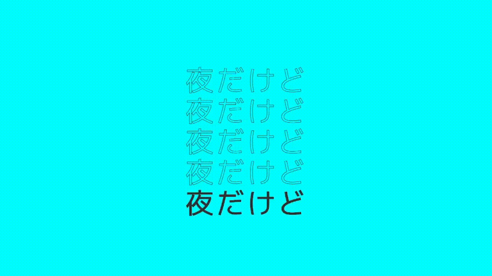
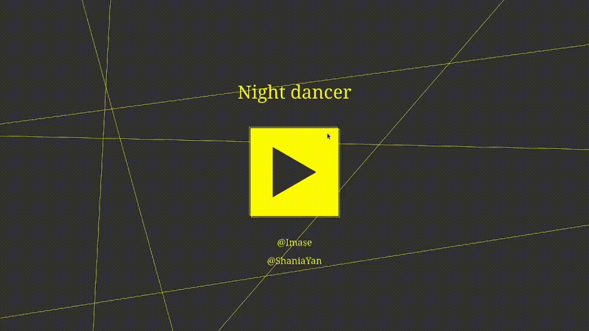

# Lyrics

The project uses canvas to enhance the aesthetic appeal of lyrics through the artful integration of typography and dynamic motion design.

## Easing functions

One of all the gols of this project was to get a better understanding of the [easing functions](https://easings.net/].

The easing functions were used to create the smoothness in the movements of the shapes and the lyrics:

Using easing functions:



Using a simple linear function:



## Add new musics

Each song must have lyrics and its time:

```js
const lyric = [
    { text: 'I look for', time: 1.2 },
    { text: 'his arrows', time: 1.0 },
    { text: 'everyday', time: 2.0 },
    { text: 'I guess', time: 1.0 },
]
```

And can be customized using these options:

```js
const music = {
    volume: 1.0,
    title: 'Cupid',
    links: [ '@FiftyFifty' ],
    lyrics: lyric,
    font: 'Bebas Neue',
    color_background: '#323232',
    colors: ['#e75b66', '#f0c1b7', '#f9a99e', '#e9d397'],
    url: 'audios/cupid.mp3'
};
```

### Preview

Try the application in the following [link](https://playground.htsuyoshiy.online/lyrics) :D
